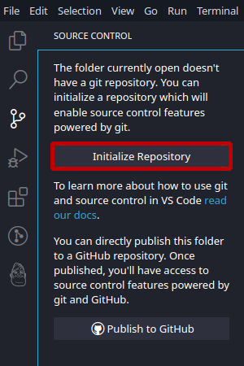
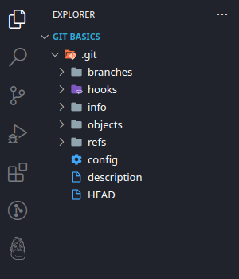
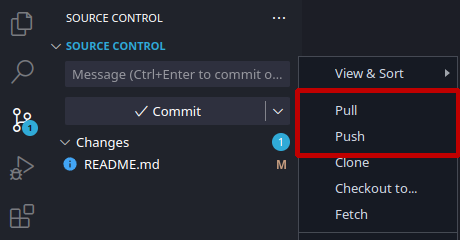

# Welcome to this short tutorial on Git


## What is Git
Git is a version control program made by Linus Torvalds (he’s also known for creating Linux). It’s main features are to easily track changes, features, versions and updates of your code. There is much more that git can do, but I will keep this tutorial to the basics to not confuse or scare anyone off.

Git is supported by most code editors. The ones that don’t natively support it most likely have an add-on to add support. Because of that, the interface for git can be different for every single editor that is being used. In this tutorial I will focus on commandline inputs and the Visual Studio Code interface for Git.

## Where to get Git
Git can be downloaded directly from [the official website](https://git-scm.com/).

There are options for different installers, operating systems and even portable versions, depending on what is best for your system and your preferences!

One important step that you should do before starting to use git is setting your name and email address. Since git is supposed to track who did what to the code, you need to provide some details on who you are. Note that you don't need to provide *real* data if you are not comfortable providing it. You can set the needed data using the following commands:
```
git config --global user.name "Your Name"
git config --global user.email "your.email@address.com"
```

## How Git works
Git is tracking your code using four different states. There is `local`, `staging`, `commit` and `server`. These mean the following:

- Local

  Local means that whatever you are writing right now, is being recognized by git. An indicator for this are different colored file names and marked lines in your editor. But you have not yet told git to save your changes in the code, i.e. you have not staged your changes yet.

- Staging

  At the staging point, Git has saved your changes. It has not written them fully into your project yet, but they are saved in Git and the manipulated or written lines of code are not showing in your editor anymore. You have basically marked your changes as *"ready for commiting"*.

- Commit

  At this point, the code is *(supposedly)* final, working and officially written into the project. You can pretty much go by the name here. You have *committed* yourself to this code and can say that it is ready.

- Server

  Git is not only here to allow you to track changes. It is also used to share your code with others. The server state is when your code/project is not only on your computer anymore, but has been sent to other people that can now built on top of your code.

## How to set up Git
The first step is to install the file you just downloaded. If you are using the portable version, make sure that the extraction foler is in the `$PATH`.

Git works with repositories which are basically just projects. That’s why for simplifications sake, I will use the two terms interchangeably in this documentation.

To initialize the project, you declare the root folder (or main folder) of your project to Git, and Git will do the rest. You do that in the following two different ways.

### Initialize the project in commandline
In the commandline, make sure you are in the root folder of your project and then type the following command into your console: `git init`. This will give us the following output:
```
Initialized empty Git repository in /***************/JTT/GitBasics/.git/
```
### Initialize the project in VSCode
In VSCode the root folder (or default folder) is automatically detected. You can simply navigate to the Git Source Control on lefthand panel and click `Initialize Repository`.



You may not see anything change in your project. This is because the files are hidden by default. Git created a new folder called `.git` in which all changes are saved.

***DO NOT EDIT ANYTHING IN THIS FOLDER MANUALLY***

Git should be the only thing to access this folder directly. Any manual change can completely break your entire repository.



## How to use git
Now you can start to code. And as you go on, you will notice certain cues in your editor. In this example case, I have files that are marked green with a letter `U` and a notification saying `4` on the Git Source Control panel.

In this scenario this means the following; The files marked with a green `U` are the files that have been newly created. The `4` on the Git Source Control means that Git has detected `4` new changes in this project.


In this example there is only the green `U`, but there are some more indicators of changed files. I will list them all here real quick:

- Green U - Newly created
- Orange M - Modified
- Red D - Deleted
- Greyed out - Ignored

Now let's save our changes first before we dive deeper into git.

You have different options for what you can do. You can revert the file into it's state from the last commit. In this case, that would be an empty file because we didn't commit anything yet.

You can open the file. In larger projects with many files, it makes sense to not always have all of them open. So this button just opens the document at the exact place where a change has been made.

You can stage the changes. Staged changes will be commited, once you press the big `Commit` button at the top of the Git Source Control.

All of those options are not only available on a file level. You can go to the changed places with the `Open File` button and stage or revert every single line individually. This is used when you have two individual changes in a file and want to stage just one of them while still working on the other.

You can also just stage every single change at once. This is a feature that is used not so often. In larger projects it only happens rarely that *everything* just so happens to be ready to commit at once. This is only used in small projects where this might very well happen, like this one, so let's do that.

After the changes have been marked, you just need to enter a commit message. This message should shortly explain what exactly you did to the code here.


**Congratulations! you just made your first commit in git!**

### Committing in the commandline
The commandline equivilents for staging and commiting and reverting are as follows:

Staging
```
git add "file"
```

Commiting
```
git commit -m "Commit Message"
```

Reverting
```
git revert "file"
```

## Tagging with git
What's the difference between tagging and commiting?

With a commit, you sum up different edits in your project and explain what these changes do.

With a tag, you basically only mark a specific commit in your project. This gives you the ability to give a proper name to a commit and it will be way easier to find later on. This is often used to mark a new version of the program itself and it's also what I will be using it for in this example.

Creating tags is really simple. In VSCode, you can click a button to create one for you. It is in the Git Source Control, under the three little dots in the Tags category. You will be prompted to give the Tag a name and a description. Tagging is generally used for new releases of a software, so it is important to make sure there is no unfinished code in the project.


The tag will also be visible in the VSCode Checkout function. The Checkout Function allows you to go back in the history of your project and see what it looked like at that specific point. I will talk about tahat a bit deeper in a second.

### Tagging in the commandline
The same process in the commandline is in my opinion a bit more straight forward. Unlike VSCode, the commandline does not automatically replace spaces with dashes, so you have to do that yourself since spaces are not allowed in tag names. You only have to enter the following command:
```
git tag -a "Git-Basic-Tutorial-v0.1" -m "Created a Tutorial in Markdown that teaches how to set up and use commits in your project"
```

## Pushing and Pulling your code with Git
Now it is finally time to talk about the server state. When you want to upload your code to an online Codesharing platform, like GitHub or BitBucket, you need to push your code. This allows you to then pull your code on a different computer to continue working on the project, to share it with your teammates, or just to upload a new version of your project for public download alltogether. The term for server that you push and pull your code onto and off of is *remote*. I will use the term remote and server interchangeably in this chapter.

### Push & Pull with VSCode
You can add a remote simply by clicking the three dots in your source control again, navigating to "Remote" and then add a new remote.

For any non-public server source, you will be able to enter the link to the remote and that's gonna be it. You will be promted for a login (if required by the server) when you push and pull the code.

For public sources, like GitHub, things are a little different. GitHub is already integrated into most editors, so this makes things easier. You can simply click on the button offering you to add a GitHub remote. This will bring up a pop-up on which you have to press *"Allow"*. This will open a window in your browser, requesting you to log into GitHub. After doing that successfully, you will get a dropdown menu, allowing you to filter and choose from all repositories for which you have editing rights.


After linking the remote, you can Push and Pull in the Source Control menu any time you want. Just click on the three dots again and pick what you need.



### Push & Pull in the commandline
In the commandline, you can first also add a remote using the following command:
```
git remote add GitHub https://github.com/tomentos/JTT_GitBasics
```
**Important notice; GitHub has removed this type of remote support from it's service. Please use the GitHub Add-on to add a remote. I will merely use GitHub here as an example on how to use Push and Pull.**

Now, after adding the remote, we can push our code onto this remote, we use this command:
```
git push GitHub
```
This is how you would normally do it. However, if you only have one single remote set up, you don't even need to specify the name. There is one problem to pushing however. By default, only the branch you are on is being pushed to the remote, and the tags are being ignored too. There is no option to push both, without also pushing data that might be exclusive to your client, like the remotes itself. Different workstations might have different remotes. Here are the commands for doing all different options:

Push all branches
```
git push GitHub --all
```

Push all tags
```
git push GitHub --tags
```

Push everything
```
git push GitHub --mirror
```

When pulling, or downloading, all the latest changes from the remote you will do the same, except that you will replace `pull` with `push`. So it will look like this:

Pull all branches
```
git pull GitHub --all
```

Pull all tags
```
git pull GitHub --tags
```

Pull everything
```
git pull GitHub --mirror
```
## Viewing the history of a project
There are multiple ways view the history in a git project. You can check out the past commits, or you can check out the Tags.

Not that the checkout function is built into VSCode as well, but only shows you branches and Tags. However, when using the commandline, you can also check out every single commit individually.

### Checkout tags in VSCode
You can access Tags by clicking on the small branch icon in the very bottom left of VSCode. Then a pop-up will appear with a selection of branches and tags. This tutorial does not teach branches, so you can ignore those if you do not understand Git well enough yet.


### Checkout tags in the commandline
To Checkout a tag in commandline, you can use the following command:
```
git checkout Git-Basic-Tutorial-v0.1
```

### Checkout commits
Checking out commits is only possible in the commandline.

You can type the following command in the console to get the commit history printed: `git log`
```
commit 7aaead9e5c68f13fb76ba68ea53ff7b47935927a (HEAD -> master)
Author: Tomentos <**********@gmail.com>
Date:   Wed Feb 8 19:48:47 2023 +0100

    Added images and commandline to tagging doc

commit 67d02d9d5e36c837256e86a68dd363cb53c5369c
Author: Tomentos <**********@gmail.com>
Date:   Wed Feb 8 19:44:38 2023 +0100

    Added a short description for tagging

commit dcd507c6fe88f10a849bc5737fe74568a1c21497
Author: Tomentos <**********@gmail.com>
Date:   Wed Feb 8 19:43:25 2023 +0100

    Created and written doc up until how to commit
```
Using the `git log` command, you get some basic information like who made the commit, when the commit was made, the commit message and in what branch the commit has been made. This tutorial still does not teach branches, so you can ignore those if you do not understand Git well enough yet.

The most important thing when it comes to commits are the IDs. Everytime you need to work with a past commit, you need to provide the ID of the commit. However, you only ever need the first few symbols of the ID. So in this case `dcd507c6` is sufficient.

Now checking out this commit works the same way as checking out a tag would, except that you just use this above ID as a replacement for the name; like this: `git checkout dcd507c6`.

Now you have basically travelled back in time to visit a previous state of your project. Here you can do different things, like tagging from a past commit, copying code that was removed and you can even change these previous things. However, I do not recommend that you do that just yet. If you want to edit your past commits, you should learn how to branch your project first, just to avoid things getting messy.

To return to the latest point in your project, you can use `git checkout master`.

## That's all folks
It may not be everything that Git has to offer, but I would consider commits, tags and checkouts to be the bare basics of it.

I hope this tutorial helped you a bit with getting to learn Git, use Git and stepping up your coding with Git. If this tutorial does well enough, and the demand for it is there, I will gladly make another one where I teach about more things you can do with Git.

### Bonus
This entire doc has been written in markdown using VSCode. So it would be a shame not to use this documentation itself for a live example on how to use Git! This documentation and all files associated with it will be made available on [my GitHub Page](https://github.com/Tomentos/JTT_Tutorials/JTT_GitBasics/JTT_GitBasics.md). I did this so you can browse this project yourself and explore all the commits that I made while writing it. This way you get a live example on how to use them and what they are useful for.

If you still have any question, don't hesitate to ask and I will be glad to help!
